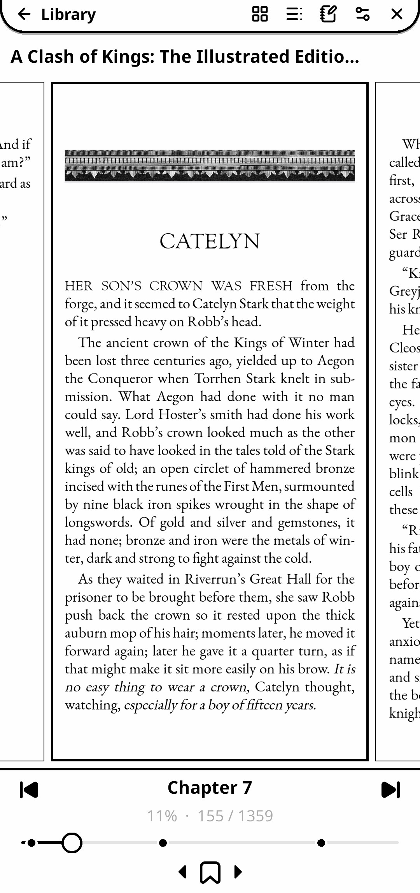
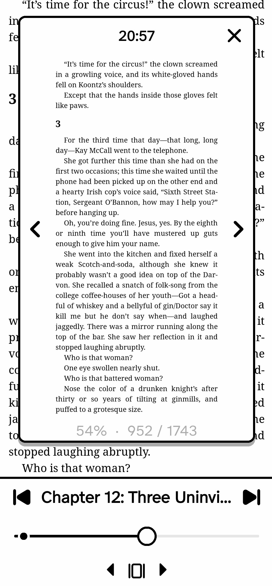
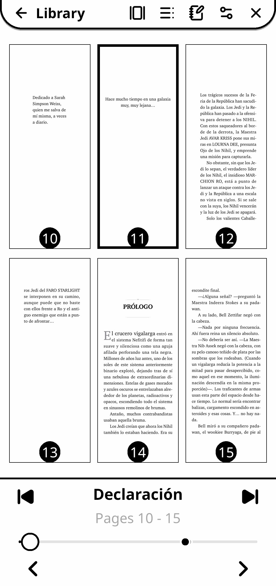
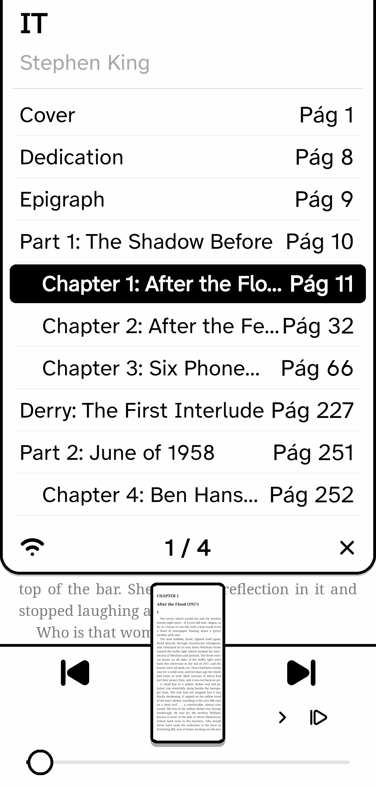
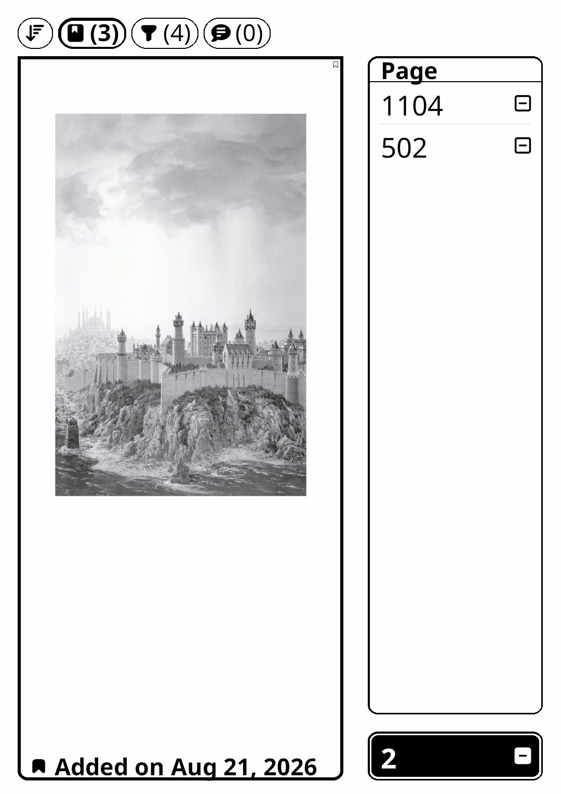
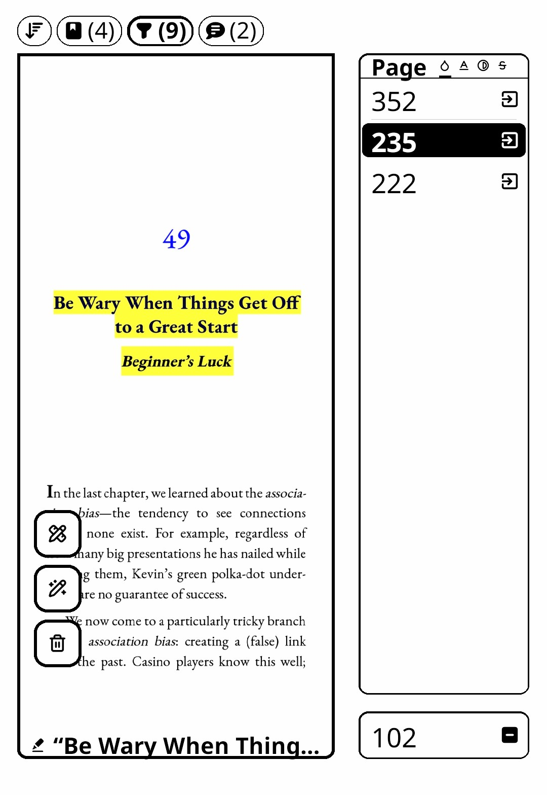
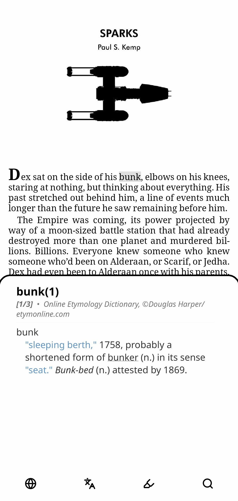
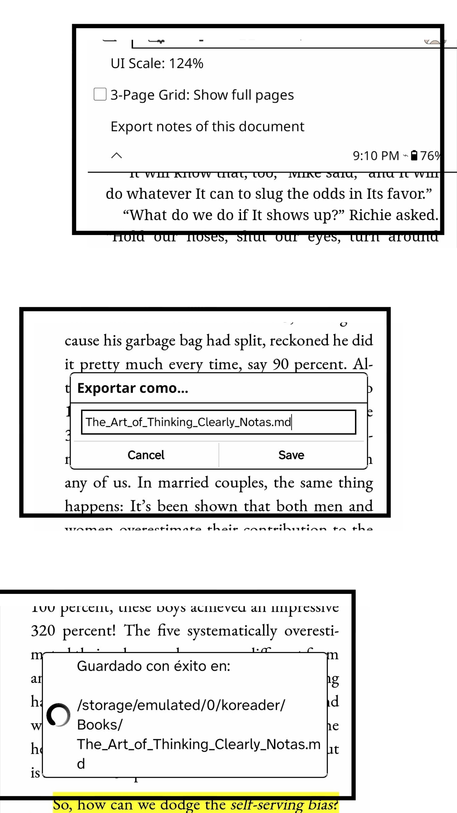

# KOReader 📚
Custom Lua patches and plugins for **KOReader** optimized for E-ink devices.

# 📖 Page Scrubber Plugin! 
This plugin allows you to quickly flip back and forth through the book, with the option to easily return to your original page using the 'x' button or stay on the new page. You can also use the interactive progress bar and bookmark browser. Streamlined, E-ink optimized, based on KOReader's browser architecture and inspired by the native Kindle page picker experience. Compatible with EPUB, CBZ, and PDFs!
   
**Features**:
* **Thumbnail Grids:** Live 3-page preview with hold-to-repeat page turning, plus a minimalist distraction-free "Simple Grid" mode.
* **Advanced Navigation:** Interactive progress slider, chapter-skip buttons, a quick-access top toolbar, and physical D-Pad support.
* **Split-View Annotations (NEW):** A beautiful split-screen manager for Bookmarks, Highlights, and Notes, featuring a live high-res page preview and smart highlight filters.
* **Robust UI Scaling (NEW):** Auto-adapting layout that prevents crashes or overlapping at any scale (long-press the Gear icon to resize).
* **Native Integration:** Launch all widgets and access settings directly from KOReader's native top menu (but obviously the easiest way to lunch the grids is with a gesture!). 

> ⚠️ **IMPORTANT:** You MUST delete any old or duplicate `.lua` scrubber/browser files from your KOReader plugins/patches folder before installing this new version.

> ⚠️ **Compatibility Note:** Page Scrubber is *not* compatible with the `2-reader-header.lua` user patch (it will cause blank thumbnails). If you want a reading header, please use the official **Bookend** plugin instead, which is 100% compatible.

Get the plugin in the release page!
## 📱 Screenshots

  <!-- Grids primero -->
  
  
  
  
  <!-- Otras vistas -->
  
  
  
  
  
  <!-- Menú al final -->
  

## ⚙️ Installation
 1. Go to the **Releases** page and download the `.zip` file of the latest version.
 2. Extract the archive. You will get a folder named `page_scrubber.koplugin`.
 3. Place that entire folder in your KOReader user plugins directory (usually `koreader/plugins/`).
 4. Restart KOReader.
   
## 🚀 Setup & Activation
 1. Open a book in KOReader.
 2. Go to **Settings** (⚙️) > **Gestures** > **Reader**.
 3. Choose your preferred gesture and bind it to any of the available actions: **Page browser: Grid**, **Page browser: Simple grid**,**Page browser: Multi-grid**, **Page browser: Menu (BM)**, or **Page browser: Menu (highlights)**. 

> 💡 **Tip:** You don't *have* to use gestures! You can also launch all 4 views and access the new configuration options directly from KOReader's top menu.

> You can only run one patch of this collection at a time; if you try to activate more than one, it won't work.
